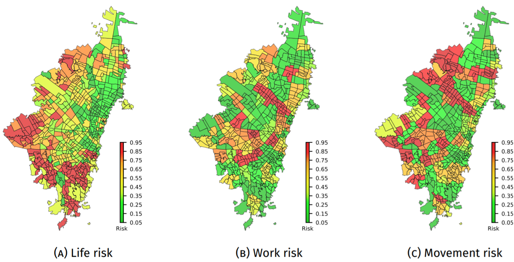

# MoRRA
**Multi-objective Risk-based Resource Allocation for Urban Pandemic Preparedness: 
The COVID-19 Case in Bogot{\'a}, Colombia**

This chapter establishes a comprehensive risk-based emergency management framework that could be used by decision-makers to determine how best to manage medical resources, as well as suggest patient allocation among hospitals and alternative healthcare facilities.  A set of risk indices are proposed by modeling the randomness and uncertainty of allocating resources in a pandemic. The city understudy is modeled as a Euclidean complex network, where depending on the neighborhood influence of allocating a resource in a demand point (i.e., informing citizens, limit social contact, allocate a new hospital) different network configurations are proposed. Finally, a multi-objective risk-based resource allocation (MoRRA) framework is proposed to optimize the allocation of resources in pandemics. The applicability of the framework is shown by the identification of high-risk areas where to prioritize the resource allocation during the current COVID-19 pandemic in Bogotá, Colombia. 
  
[](https://www.medrxiv.org/content/10.1101/2021.02.24.21252407v1)

## Directories
- Technical report : explains the methodology used for the modeling. 

## Copyright
The Copyright of the INFEKTA belongs to the ALIFE and MIDAS research groups at 
Universidad Nacional de Colombia.  You are free to use the INFEKTA for research purposes. 
All publications which use this model or any code in the model should acknowledge the use of **MoRRA** and reference
_"Prieto, J., & Gomez, J. (2021). 
Multi-objective Risk-based Resource Allocation for Urban Pandemic Preparedness: 
The COVID-19 Case in Bogotá, Colombia. medRxiv."_.

```
@article{prieto2021multi,
  title={Multi-objective Risk-based Resource Allocation for Urban Pandemic Preparedness: The COVID-19 Case in Bogot{\'a}, Colombia},
  author={Prieto, Jeisson and Gomez, Jonatan},
  journal={medRxiv},
  year={2021},
  publisher={Cold Spring Harbor Laboratory Press}
}
```  